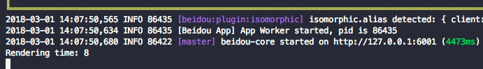

# Beidou view react

Beidou react view plugin, used by `beidou-core`

## Install

```bash
$ npm install beidou-view-react --save
```

## Configuration

Default configs

```js
const path = require('path');

module.exports = appInfo => ({
  /**
   * React view options
   * @member Config#react
   */
  react: {
    // React view rendering middlewares
    middlewares: ['cache', 'redux', 'partial', 'render', 'beautify', 'doctype'],
    // optional, beautify HTML snippet
    beautify: false,
    //optional, if false, clean require cache for development usage
    cache: true,
    //optional, true: renderToString or false: renderToStaticMarkup
    internals: true,
    //optional, HTML doctype
    doctype: '<!DOCTYPE html>',
    assetHost: '',
    assetPath: '/build/',
  },
  view: {
    defaultViewEngine: 'react',
    defaultExtension: '.jsx',
    // Isomorphic directories
    root: `${path.join(appInfo.baseDir, 'app/views')},${path.join(
      appInfo.baseDir,
      'client'
    )}`,
  },
});
```

### Use **internal render component**

Use internal render component `Render` in View.

```jsx
export default class View extends React.Component {
  render() {
    const { helper, Render } = this.props;
    return (
      <html>
        <head>
          <title>Script</title>
          <link rel="stylesheet" href={helper.asset('index.css')} />
        </head>
        <body>
          <Render stream id="container">
            <App />
          </Render>
        </body>
      </html>
    );
  }
}
```

The content inside `<Render />` element would be dynamicly rendered and set back into the view.

**Props**

|  props   |        type         | default |                          usage                          |
| :------: | :-----------------: | :-----: | :-----------------------------------------------------: |
| disable  |       Boolean       | `false` |    disable server-side rendering, `true` to disable     |
| element  | String or Component |  `div`  |          the element type of render container           |
|  stream  |       Boolean       | `false` |          `true` to use `renderToNodeStream()`           |
|   app    |      ReactNode      |  null   |            the component should be rendered             |
| children |      ReactNode      |  null   |                       same as app                       |
| [others] |         any         |         | any other props will be passed to `element` you defined |

#### The difference between `<Render />` and `getPartial()`

**`getPartial()`**

The components returnd from `getPartial()` will be rendered into string and put back to props,
You can manipulate them in View template. So the _Partial_ rendered first, and then is the template.

**`<Render />`**

But, for the `<Render />` component, it contains dynamic parts waiting to be rendered. When View template is rendered, each instance of `<Render />` will generate a markup (placeholder) in template result string, View Engine replace regonizes them, gets true parts should be rendered, render and replaces the markups in sequence.

In this mode, template rendered before the dynamic parts. So we can get the first part of page at very beginning, and send it the browser to reduce TTFB.

### Custom view middlewares

You can access view rendering process to meet your needs. For example, if you want to record rendering time, you need to write a `time.js` to your `app/view-middlewares/` directory. If you don't understand middleware please read [middlewares](https://eggjs.org/en/intro/egg-and-koa.html) before you digging into code.

```js
// app/view-middlewares/time.js

/**
 * @param {Object} viewCtx - view context
 * @param {String} viewCtx.filepath - rendering file path
 * @param {Class} viewCtx.Component - sub class of React.Component
 * @param {Object} viewCtx.props - rendering props
 * @param {String} viewCtx.html - rendering html string
 * @param {Object} viewCtx.config - app.config, access to all config
 * @param {Object} viewCtx.options - app.config.react
 * @param {Function} next - middleware next function
 */
module.exports = async function(viewCtx, next) {
  const startTime = Date.now();
  await next(); // Execute other middlewares
  console.log(`Rendering time: ${Date.now() - startTime}`);
};
```

Set appropriate middlewares order

```js
// config/config.default.js

module.exports = () => ({
  react: {
    middlewares: [
      // Recording time at begining
      'time',
      'cache',
      'redux',
      'partial',
      'render',
      'doctype',
      'beautify',
    ],
  },
});
```

Start the [view-middleware demo project](../../examples/view-middleware/README.md) local server, you will get something like below:



### Using CDN

You may use CDN resources when your project online. First you need build your project to assets and upload to your CDN server, then custom your asset config in `config.prod.js`.

```js
// config/config.prod.js

module.exports = {
  react: {
    assetHost: '//your-cdn.com',
    assetPath: '/project/1.0.0',
  },
};
```

In your project entry `render` method, using `this.props.helper.asset('main.js')` you will get `//your-cdn.com/project/1.0.0/main.js`

## Usage

Using render method in your controllers

```js
// app/controller/index.js
exprots.index = async function() {
  await this.ctx.render('path/to/index.jsx', {
    user: 'beidou view',
  });
};
```

## API

React view exports `render` and `renderString` 2 APIs, return Promise.

> - ctx.render(name, locals) - render template, and assign to ctx.body
> - ctx.renderString(tpl, locals) - only render template to string, will **not** assign to ctx.body

## License

[MIT](LICENSE)
